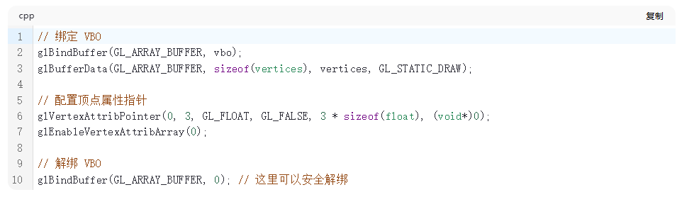
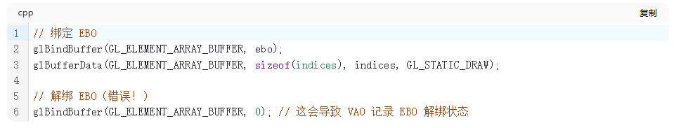
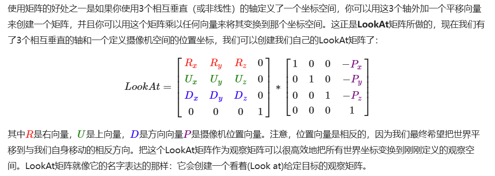

# GPT Q&A

## 片段和像素

在计算机图形学中，**片段（Fragment）** 和 **像素（Pixel）** 是两个密切相关但又有所区别的概念。理解它们的区别和联系对于掌握渲染管线的工作原理非常重要。

1. **片段的含义**

**片段（Fragment）** 是光栅化阶段生成的一个潜在像素候选者。它代表了屏幕上某一个位置可能的颜色、深度、纹理坐标等信息，但它并不一定是最终显示在屏幕上的像素。

- 片段是渲染管线中间阶段的产物。
- 每个片段对应于屏幕上的一个潜在像素位置。
- 在片段着色器（Fragment Shader）阶段，GPU会对每个片段进行处理，计算其颜色、深度等属性。

**关键点：**

- 片段不一定会成为最终的像素，因为可能会被深度测试（Depth Test）、模板测试（Stencil Test）或混合（Blending）等操作剔除或修改。
- 片段可以看作是一个“临时”的像素候选者。

2. **像素的含义**

**像素（Pixel）** 是显示器上实际显示的基本单位，表示屏幕上一个具体的点。每个像素都有一个最终的颜色值，该值直接决定了屏幕上显示的内容。

- 像素是渲染管线输出的结果。
- 它是片段经过一系列测试（如深度测试、模板测试）和处理（如混合）后，最终确定的颜色值。

**关键点：**

- 像素是固定的，与屏幕分辨率相关。
- 每个像素只能有一个颜色值，而片段可能有多个候选者竞争同一个像素位置。

3. **片段和像素的区别**

| **特性**     | **片段（Fragment）**                                       | **像素（Pixel）**                              |
| ------------ | ---------------------------------------------------------- | ---------------------------------------------- |
| **定义**     | 渲染管线中的一个中间结果，代表可能的像素候选者。           | 显示器上实际显示的基本单位，具有最终的颜色值。 |
| **数量关系** | 可能多于像素数量（例如，多个片段可能竞争同一个像素位置）。 | 数量固定，等于屏幕分辨率（宽度 × 高度）。      |
| **生命周期** | 存在于渲染管线的中间阶段，可能被剔除或修改。               | 是渲染管线的最终输出，直接显示在屏幕上。       |
| **属性**     | 包含颜色、深度、纹理坐标等信息，但尚未确定是否会被显示。   | 只包含最终的颜色值。                           |
| **生成时机** | 在光栅化阶段生成。                                         | 在片段通过所有测试后生成。                     |

4. **为什么需要片段？**

片段的存在是为了支持复杂的渲染操作。以下是几个原因：

1. **抗锯齿（Anti-Aliasing）** ：
   - 在光栅化过程中，三角形的边缘可能覆盖到多个像素的部分区域。
   - 为了实现平滑的边缘效果，系统会生成多个片段来表示这些部分覆盖的区域，并计算每个片段的权重。
2. **深度测试（Depth Testing）** ：
   - 当多个三角形重叠时，每个三角形都会生成片段。
   - 深度测试会比较这些片段的深度值，决定哪个片段最终显示为像素。
3. **透明度和混合（Transparency and Blending）** ：
   - 透明物体可能需要多个片段的颜色混合才能得到最终的像素颜色。
4. **多重采样（Multisampling）** ：
   - 多重采样技术会在每个像素内生成多个片段，以提高抗锯齿质量。

------

5. **总结**

- **片段** 是渲染管线中的中间产物，代表可能的像素候选者。
- **像素** 是最终显示在屏幕上的结果。
- 片段可能多于像素数量，因为多个片段可能竞争同一个像素位置。
- 片段通过各种测试和处理后，才会成为最终的像素。

**最终答案：**

片段是渲染管线中的中间产物，代表可能的像素候选者；像素是最终显示在屏幕上的结果。

​							也就是说 一个片段如果最终出现在屏幕上， 它大小一定是一个像素 不会大于一个像素？

你的理解是正确的：**一个片段如果最终出现在屏幕上，它的大小一定是一个像素，不会大于一个像素。**

## VAO, VBO, EBO绑定与解绑

这个问题涉及到 OpenGL 中 **VAO (Vertex Array Object)** 、**VBO (Vertex Buffer Object)** 和 **EBO (Element Buffer Object)** 的绑定机制以及它们之间的关系。为了清晰地解释为什么可以在解绑 VAO 之前解绑 VBO，但不能解绑 EBO，我们需要从以下几个方面进行分析。

------

 **1. VAO 的作用**

VAO 是一个状态对象，用于存储与顶点数据相关的配置信息，包括：

- **顶点属性指针的配置** （通过 `glVertexAttribPointer` 设置）。
- **绑定到 `GL_ARRAY_BUFFER` 的 VBO** （用于顶点数据）。
- **绑定到 `GL_ELEMENT_ARRAY_BUFFER` 的 EBO** （用于索引数据）。

当 VAO 被绑定时，所有后续的顶点属性配置和缓冲区绑定操作都会被记录到该 VAO 中。因此，VAO 的状态完全决定了绘制时如何使用顶点和索引数据。

------

 **2. VBO 和 EBO 的绑定机制**

 **VBO 的绑定机制**

- 当你调用 `glBindBuffer(GL_ARRAY_BUFFER, vbo)` 绑定一个 VBO 时，这个绑定是临时的。
- 当你调用 `glVertexAttribPointer` 配置顶点属性时，OpenGL 会将当前绑定的 VBO 记录到 VAO 中。
- 一旦 VBO 被记录到 VAO 中，VBO 的绑定状态就不再重要了。即使你调用 `glBindBuffer(GL_ARRAY_BUFFER, 0)` 解绑 VBO，也不会影响 VAO 中的记录。

 **EBO 的绑定机制**

- 当你调用 `glBindBuffer(GL_ELEMENT_ARRAY_BUFFER, ebo)` 绑定一个 EBO 时，这个绑定会被直接记录到当前绑定的 VAO 中。
- 不同于 VBO，EBO 的绑定状态是与 VAO 强关联的。如果你在 VAO 激活时调用 `glBindBuffer(GL_ELEMENT_ARRAY_BUFFER, 0)` 解绑 EBO，那么 VAO 会记录这个解绑操作，导致 EBO 的绑定丢失。
- 这意味着，下次重新绑定该 VAO 时，OpenGL 将无法找到之前绑定的 EBO，从而导致绘制失败。

------

 **3. 为什么可以解绑 VBO？**

当你调用 `glVertexAttribPointer` 配置顶点属性时，OpenGL 已经将当前绑定的 VBO 记录到 VAO 中。此时，VBO 的绑定状态已经不再重要，因为 VAO 已经保存了对 VBO 的引用。

在这段代码中：

- `glVertexAttribPointer` 已经将 VBO 的引用记录到 VAO 中。

- 即使解绑了 VBO（通过 `glBindBuffer(GL_ARRAY_BUFFER, 0)`），VAO 中仍然保存了对 VBO 的引用，因此不会影响后续的绘制操作。

**4. 为什么不能解绑 EBO？**

  EBO 的绑定状态是直接存储在 VAO 中的。如果你在 VAO 激活时解绑 EBO，VAO 会记录这个解绑操作，导致 EBO 的绑定丢失。

- 当你调用 `glBindBuffer(GL_ELEMENT_ARRAY_BUFFER, 0)` 时，VAO 会记录这个解绑操作。
- 下次重新绑定该 VAO 时，OpenGL 将无法找到之前绑定的 EBO，导致绘制失败。

正确的做法是保持 EBO 绑定状态不变，直到完成所有 VAO 配置后再解绑 VAO。

**总结：在完成所有配置操作之前都不要解绑VBO或EBO，直到所有配置都完成，先解绑VAO，再解绑VBO, EBO**

# NOTES 

## 着色器程序

## 典型的变换矩阵

- 平移矩阵

- 缩放矩阵

- 绕轴旋转矩阵

- LookAt矩阵

